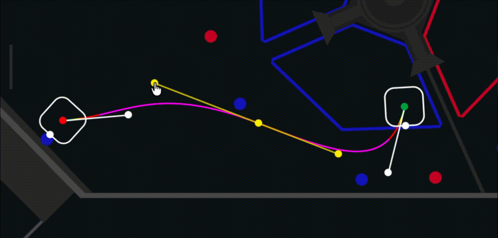
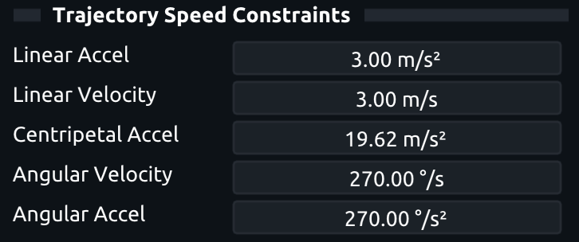
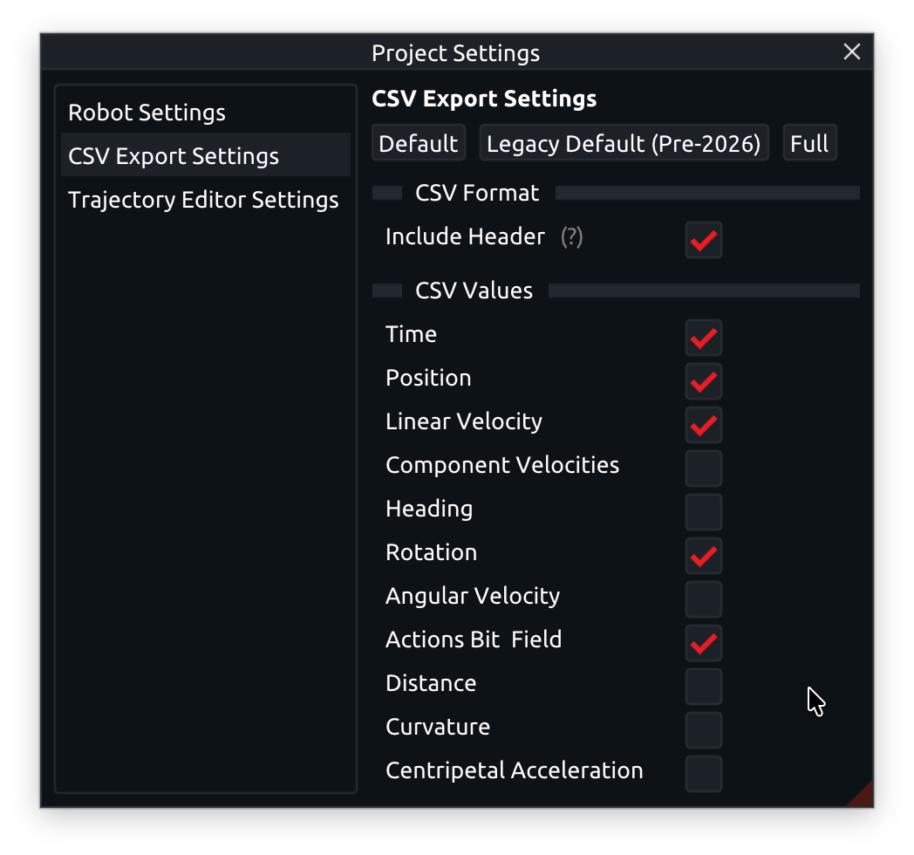

# ThunderAuto Trajectories

{width="300" align="right"}

A ThunderAuto Trajectory defines a path for the robot to follow on the field. 

ThunderAuto Trajectories consist of three main components:

- [Points](#points)
- [Rotation Targets](#rotation-targets)
- [Action Markers](#action-markers).

## Creating a New Trajectory

To create a new trajectory, click the __+ New Trajectory__ button in the Trajectories panel and enter your desired trajectory name in the popup dialog.

## Trajectory Components

### Points

{width="300" align="right"}

Points define the path of the trajectory. Points have position (X, Y) coordinates on the field, as well as incoming and outging heading and weight values for shaping the trajectory.

Points can be added to a trajectory by double-clicking the field in the editor, or by right-clicking the field and selecting __Insert Point Here__.

You can drag points around in the editor, or adjust their values manually in the Properties panel.

### Rotation Targets

{width="300" align="right"}

Rotation Targets define the robot's orientation at specific points along the trajectory.

Rotation Targets can be added by right-clicking the trajectory in the editor and selecting __Add Rotation Target Here__.

You can drag Rotation Targets along the trajectory and adjust their rotations in the editor, or adjust their values manually in the Properties panel.

### Action Markers

{width="300" align="right"}

Action Markers define positions along the trajectory where specific actions should be performed. See the [Actions](actions.md) section for information about defining actions.

Action Markers can be added by right-clicking the trajectory in the editor and selecting __Add Action Here__, then selecting the desired action from the list. You must first define actions in the Actions panel before they will appear in this list.

You can drag Action markers along the trajectory in the editor, or adjust their values manually in the Properties panel.

## Trajectory Velocity/Acceleration Constraints

{width="300" align="right"}

In the Properties panel under the __Trajectory Speed Constraints__ section, you can set maximum linear velocity/acceleration, centripetal acceleration, and angular velocity/acceleration constraints for the trajectory. 

ThunderAuto will guarantee that these constraints are not exceeded at any point along the trajectory.

## Advanced Trajectory Editing

### Overriding Point Velocities

{width="300" align="right"}

In the Properties panel for a trajectory point, you can override the maximum velocity at that point to be lower than the configured maximum velocity for the trajectory. 
This property can be useful for slowing down when approaching a bump or other obstacle. 

When set to 0 m/s, the robot will come to a complete stop at that point, and you can specify the rotation that the robot should stop at, and any actions to be performed while stopped before continuing.

### Linking Trajectory End Behaviors

Often, your robot will need to run multiple trajectories in sequence during an autonomous mode (see the [Auto Modes](auto-modes.md) section for information about how to define these sequences in ThunderAuto). To be able to seamlessly transition between trajectories, the end behavior (position and rotation) of one trajectory must match the start behavior of the next trajectory. To make this easy, ThunderAuto lets you link the start/end behavior (position and rotation) of one trajectory to the start/end of another trajectory. When linked, any changes to the start/end behavior of one trajectory will automatically update the linked trajectories to match.

You can edit the start/end behavior links of a trajectory either in the Properties panel under the __Trajectory Properties__ section, or by right-clicking the trajectory in the Trajectories panel and selecting __Link Start/End Behavior__.

### Linking Trajectory Points

You can also link the position of any trajectory points together by right-clicking the point in the Properties panel and selecting __Link__.

## Exporting Trajectories to CSV Files

The simplest way to run ThunderAuto trajectories on your robot is to use [ThunderLib](../thunderlib/index.md) to load the ThunderAuto project files directly and provide a simple command-based API for running trajectories.
Instead, trajectories can be exported to CSV files from ThunderAuto and loaded onto the robot, where they can be executed using your own trajectory-following code.

### CSV Export Settings

{width="300" align="right"}

To edit what data is included in the exported CSV files, open the __Project Settings__ window and navigate to the __CSV Export Settings__ tab.

Here you can choose whether to include a header row in the CSV files, as well as which data columns are included.

### Exporting Trajectories

To export a single trajectory to a CSV file, select __Trajectory > Export to CSV__ from the top menu bar while the desired trajectory is open in the editor.

To export all trajectories in the project at once, press __File > Export All Trajectories to CSV__ from the top menu bar, or press __Ctrl+E__.

Exported trajectory CSV files are stored in the same directory as the ThunderAuto project file. Exported CSV files are named `<trajectory_name>.csv`. CSV files get overwritten without warning each time they are exported.
